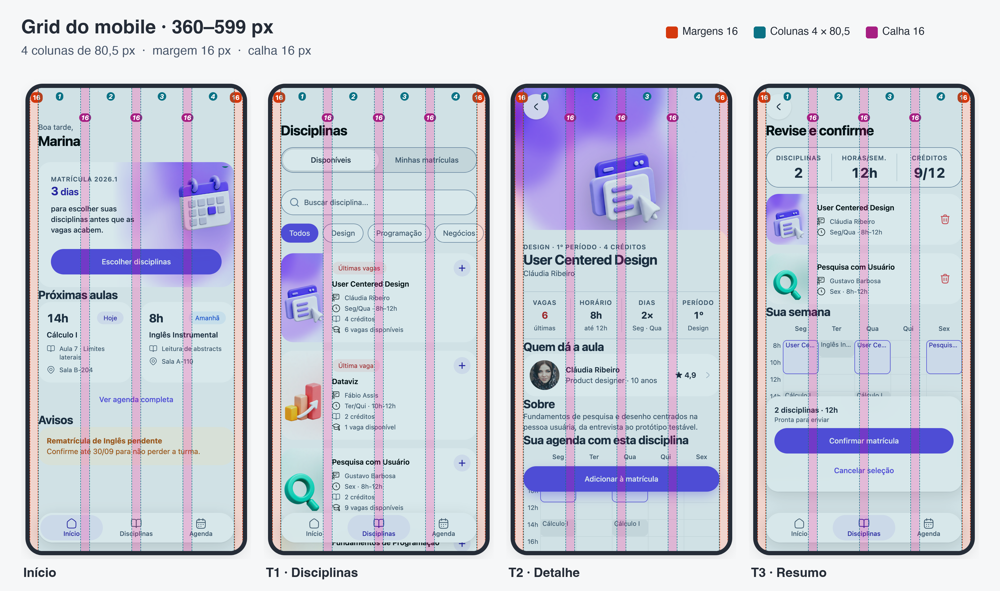

# Design System — O caso Marina

Fonte visual: [DS-Marcos no Figma](https://www.figma.com/design/i0bI1RNEF71UV3tgCpkHst/DS-Marcos?node-id=47-9). As **115 variáveis locais** foram exportadas para `src/styles/figma-tokens.css` e `src/styles/figma-tokens.json`, mantendo nomes, valores e aliases. A tabela abaixo é o **recorte de 33 tokens usados para explicar a decisão da entrega**, dentro do limite de 25–40 do enunciado. Valores do Figma não usados na interface permanecem no inventário, mas não aumentam a escala ativa.

## Princípios de uso

| Princípio | Decisão que orienta | Oposto plausível | Por que este vence para Marina |
| --- | --- | --- | --- |
| Disponibilidade antes da confirmação | Vagas aparecem em cada cartão e no detalhe; a confirmação futura verificará a vaga outra vez | Mostrar vagas apenas no resumo para reduzir ruído | Marina teme perder a vaga enquanto decide; a informação precisa acompanhar a escolha |
| Ação reversível | Seleção pode ser desfeita e o bottom sheet fecha sem alteração | Seleção avança imediatamente sem retorno | Marina tem pressa e medo de errar; reversão permite comparar sem penalidade |
| Conteúdo essencial no celular | Cartão mostra nome, professor, horário e vagas na lista móvel | Deixar professor e horário só no detalhe para cartões menores | Comparar as opções na lista reduz a navegação necessária |

## Base visual ativa

- **Grid móvel (360–599px): 4 colunas · margem 16 · calha 16.** Tela de 402px, margem lateral de 16px (conteúdo útil de 370px) e 4 colunas de **80,5px** separadas por calha de 16px: (370 − 3 × 16) ÷ 4 = 80,5. Margem e calha usam o mesmo valor (`space/16`), então o espaço entre colunas é o mesmo espaço entre cartões. O que fica lado a lado obedece à grade: os dois cartões de “Próximas aulas” ocupam 2 colunas cada, a faixa de fatos do detalhe (Vagas, Horário, Dias, Período) tem 1 coluna cada, e o cartão repete a mesma grade por dentro: a arte ocupa exatamente a coluna 1 (encostada na borda, recortada pelo raio do cartão) e o texto as colunas 2 a 4, com a calha de 16 entre eles. Em Storybook (Fundamentos/Grid e layout), margens, colunas e calha podem ser ligadas e desligadas sobre as telas reais; os prints abaixo vêm dessa página.

Prints individuais: [`grade-inicio.png`](../evidencias/grid/grade-inicio.png), [`grade-t1-disciplinas.png`](../evidencias/grid/grade-t1-disciplinas.png), [`grade-t2-detalhe.png`](../evidencias/grid/grade-t2-detalhe.png) e [`grade-t3-resumo.png`](../evidencias/grid/grade-t3-resumo.png).
- **Quebras (2 pontos, razão pela largura do texto):** **360px**: menor largura do grid Mobile. Com 4 colunas, margem 16 e calha 16, a coluna de texto do cartão (3 colunas, menos o + de 48px) tem ~194px, cerca de 26 caracteres de título por linha; abaixo disso cai de ~25 e quebra demais. **600px**: a coluna de 402px (~60 caracteres por linha, o limite de leitura confortável) deixa de ocupar a tela e é centralizada, com cantos e sombra. Nenhum ponto vem do nome de um aparelho.
- **Raios (3 valores):** **8px** (blocos e eventos da agenda e do calendário, caixa de seleção, capa do professor), **24px** (cartões, bottom sheets e mensagens) e **pílula** 9999px (botões, busca, chips, barras flutuantes). Os blocos da agenda têm 32px de altura por 2h; com 16px de raio viravam pílula, por isso o raio pequeno é 8 (decisão 24). A arte do cartão não tem raio próprio: ocupa a coluna 1 até a borda e é recortada pelo raio do cartão (24). Os raios de 4, 12, 16 e 32 do Figma ficam só no inventário exportado.
- **Duração (3 degraus):** rápida 120ms (feedback de botão e troca de segmento), média 240ms (navegação, folhas e reversão) e lenta 400ms (carregamento e entrada da confirmação). A única animação em laço, o esqueleto de carregamento, dura 4 × a lenta (1,6s); a animação decorativa de flutuar foi removida. São tokens do projeto, pois o Figma não tinha variáveis de duração.

### Escala de espaço (4 · 8 · 12 · 16 · 24 · 32 · 48 · 64) e regras de uso

Nenhum espaço da tela fica fora dessa lista (auditado no navegador em 03/10/2026). O Figma também exporta `space/40`; ele não entra, porque a escala do enunciado não o inclui (ver decisão 20). As reservas de 192px (3 × 64, `--clearance-bars`) e de 256px (4 × 64, só na T3, onde a barra fixa é um cartão alto) existem só para as barras flutuantes não cobrirem o último conteúdo.

| Valor | Regra: quando usar | Exemplo no protótipo |
| --- | --- | --- |
| 4 | Entre duas partes da mesma informação | Selo ↔ título; linhas de metadados do cartão |
| 8 | Entre itens relacionados do mesmo grupo | Chips entre si; ícone ↔ texto |
| 12 | Entre elementos de um mesmo bloco que precisam respirar | Título de seção ↔ conteúdo; padding de campos e de blocos pequenos |
| 16 | **Margem e calha do grid**; entre cartões irmãos; preenchimento de cartão só de texto | Margem lateral; entre colunas; arte ↔ texto no cartão; cartões da lista e do resumo; cartão de aula |
| 24 | Entre grupos dentro de uma seção; preenchimento de superfície grande | Cartão de prazo (hero); bottom sheets |
| 32 | Entre seções da tela | “Sua semana”, “Próximas aulas”, “Avisos” |
| 48 | Respiro de fim de bloco grande | Base da arte de confirmação |
| 64 | Reserva sob a barra do topo | Início de toda tela |

### Escala tipográfica (base 14px, +4px por degrau, mínimo 12px)

A base do sistema é o corpo de 14px; cada degrau acima soma 4px. São exatamente 5, nomeados pelo uso. O que não declara tamanho herda os 14px do `body`, nunca os 16px do navegador. O número de destaque do prazo (“3 dias”) usa o degrau de título de tela; não há um sexto degrau. **Controles e texto usam o corpo (14)**: botões, links, campos e nome da disciplina no cartão não sobem de tamanho; o 18 fica para títulos de seção.

| Degrau (uso) | Tamanho / linha | Onde aparece |
| --- | --- | --- |
| Legenda | 12 / 16 | Metadados, selos, horas da agenda, rótulos de aba |
| Corpo | 14 / 20 | Texto corrido, **botões e links**, busca, chips, mensagens, nome da disciplina no cartão, nome do professor, descrição |
| Título de seção | 18 / 24 | “Próximas aulas”, “Sua semana”, título de bottom sheet e da barra de navegação; também números de apoio (“dias”, estatísticas do professor, data do calendário) |
| Valor de destaque | 22 / 28 | Hora da próxima aula |
| Título de tela | 26 / 32 | “Disciplinas”, “Revise e confirme”, nome da disciplina, número de destaque |

Os tamanhos 13, 16, 20, 24, 28 e 56 do Figma permanecem no inventário exportado, mas foram sobrescritos em `src/styles/global.css` (`:root`) pelos degraus acima. Se o Figma for atualizado, estes cinco valores são a referência.

## Cinco neutros contra o fundo da tela

Fundo `#f6f7f8`. Razão calculada pela fórmula de luminância relativa WCAG; valores arredondados a duas casas.

| Neutro | Hex | Contraste | Uso |
| --- | --- | --- | --- |
| gray/50 | #f6f7f8 | 1,00:1 | Fundo |
| gray/200 | #ced5de | 1,39:1 | Borda decorativa |
| gray/400 | #8e9db3 | 2,58:1 | Borda forte de controle |
| gray/600 | #475569 | 7,06:1 | Texto secundário acessível |
| gray/900 | #252c37 | 13,10:1 | Texto de maior contraste |

O Figma usa `gray/500` (`#70839e`) em `color/text/secondary`, medindo **3,61:1** contra o fundo. Para texto de 14px, a interface em código substitui o alias ativo por `gray/600` (7,06:1), mantendo o valor original no inventário exportado.

## Pares de cor garantidos

| Papel | Fundo | Texto | Contraste |
| --- | --- | --- | --- |
| Ação | #5b46e5 | #ffffff | 6,08:1 |
| Erro | #fdeded | #b91c1c | 5,70:1 |
| Sucesso | #eaf7ee | #15803d | 4,55:1 |

## Tabela de tokens da entrega

Valores hexadecimais aparecem somente nas linhas primitivas. Um valor `var(...)` aponta para outro token, sem duplicar a cor.

| Nome | Valor | Camada | Razão |
| --- | --- | --- | --- |
| color/gray/50 | #f6f7f8 | Primitiva | Fundo neutro da tela |
| color/gray/100 | #e6e8eb | Primitiva | Superfície neutra alternativa |
| color/gray/200 | #ced5de | Primitiva | Borda discreta |
| color/gray/400 | #8e9db3 | Primitiva | Borda de controle |
| color/gray/600 | #475569 | Primitiva | Texto secundário legível |
| color/gray/900 | #252c37 | Primitiva | Texto escuro |
| color/purple/500 | #5b46e5 | Primitiva | Marca e ação |
| color/purple/600 | #331cc9 | Primitiva | Hover da ação |
| color/red/50 | #fdeded | Primitiva | Fundo de erro |
| color/red/700 | #b91c1c | Primitiva | Texto de erro |
| color/green/50 | #eaf7ee | Primitiva | Fundo de sucesso |
| color/green/700 | #15803d | Primitiva | Texto de sucesso |
| color/white | #ffffff | Primitiva | Superfície e texto inverso |
| space/8 | 8px | Primitiva | Separar itens próximos |
| space/16 | 16px | Primitiva | Margem e preenchimento padrão |
| space/24 | 24px | Primitiva | Separar seções |
| space/32 | 32px | Primitiva | Separar seções |
| space/48 | 48px | Primitiva | Respiro de fim de bloco grande; entra na escala do enunciado (o Figma só tinha 40) |
| color/bg/primary | var(--color-gray-50) | Semântica | Fundo da página |
| color/bg/secondary | var(--color-white) | Semântica | Superfície de cartões |
| color/text/primary | var(--color-navy-900) | Semântica | Leitura principal |
| color/text/secondary | var(--color-gray-600) | Semântica | Legibilidade medida; ajuste do Figma |
| color/text/inverse | var(--color-white) | Semântica | Texto sobre ação |
| color/border/default | var(--color-gray-200) | Semântica | Divisória discreta |
| color/border/brand | var(--color-purple-500) | Semântica | Seleção visível |
| color/action/primary/default | var(--color-purple-500) | Semântica | Ação principal |
| color/action/primary/hover | var(--color-purple-600) | Semântica | Resposta ao ponteiro |
| color/feedback/error/bg | var(--color-red-50) | Semântica | Erro sem depender só da cor |
| color/feedback/error/text | var(--color-red-700) | Semântica | Mensagem de erro legível |
| color/feedback/success/bg | var(--color-green-50) | Semântica | Confirmação futura |
| color/feedback/success/text | var(--color-green-700) | Semântica | Texto da confirmação |
| radius/button | var(--radius-full) | Componente | Botão redondo do Figma |
| radius/input | var(--radius-full) | Componente | Busca redonda do Figma |
| radius/card | var(--radius-xl) | Componente | Cartão e bottom sheet a 24px (no sheet, só os cantos de cima): o maior raio do sistema depois da pílula |
| radius/inner | var(--radius-sm) | Componente | Raio pequeno a 8px: blocos da agenda, eventos do calendário, caixa de seleção e capa do professor |
| material/glass | color-mix(white 86%) + blur 24px | Semântica | Único material translúcido, só em barras que flutuam sobre conteúdo; 86% é o mínimo que mantém 4,5:1 com conteúdo escuro por baixo |
| shadow/float | 0 8px 32px preto 14% | Semântica | Só o que flutua tem sombra; cartões ficam planos |
| ease/standard · ease/spring | cubic-bezier(.2,.8,.2,1) · (.34,1.56,.64,1) | Primitiva | Padrão para navegação; mola só em confirmações (adicionar, ✓) |

**Observação de rastreabilidade:** `color/text/primary` referencia `color/navy/900`, também presente no inventário completo. Esta tabela é uma seleção para apresentação, não um arquivo de resolução autônomo.

## Componentes

Estrutura de sete seções adotada para os quatro componentes obrigatórios: 1. finalidade; 2. anatomia; 3. variantes e estados; 4. comportamento; 5. conteúdo; 6. acessibilidade; 7. tokens e implementação. O enunciado exige sete seções, mas não define os nomes.
